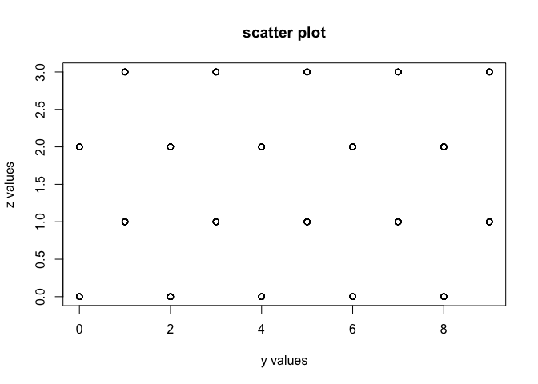

R client for kdb+
-----------------

Execute kdb+ queries from R for advanced high-performance analytics.

See [Interfacing with R](http://code.kx.com/q/interfaces/with-r/) on Kx wiki.
-----------------------------------------------------------------------------

Installation
============

``` r
# remove old package
if('qserver' %in% rownames(installed.packages())) remove.packages('qserver')
# install devtools
if(! 'devtools' %in% rownames(installed.packages())) install.packages('devtools')
library(devtools)
# install rkdb
devtools::install_github('kxsystems/rkdb', quiet=TRUE)
library(rkdb)
```

First steps
===========

Open a q server and connect to it
---------------------------------

Open a qserver to test the installation

``` r
q -p 1234
```

Open a connection to it

``` r
h <- open_connection('localhost',1234) #this open a connection
```

Hello kdb
---------

You can evaluate any kdb expression and its result will come back to R:

``` r
execute(h, '1+1')
```

    ## [1] 2

Assigning a variable in q workspace also works:

``` r
execute(h, 'x:1+1') #assign x hopefully to 2
```

    ## NULL

``` r
execute(h, 'x') # get back the value
```

    ## [1] 2

Getting data from kdb to R
==========================

As per [Q for mortals](http://code.kx.com/q4m3/2_Basic_Data_Types_Atoms/) kdb uses some basic types that might not have a direct equivalent in R. Note also that this is not a bijective operation. The conversions (from kdb to R, at time of writing) are:

| kdb/q                       | r            |
|-----------------------------|--------------|
| boolean                     | logical      |
| byte                        | integer      |
| short                       | integer      |
| int                         | integer      |
| long                        | numeric      |
| real                        | numeric      |
| float                       | numeric      |
| char                        | character    |
| symbol                      | character    |
| timestamp                   | POSIXct      |
| month                       | integer      |
| date                        | Date         |
| datetime                    | POSIXct      |
| timespan                    | character    |
| minute                      | difftime     |
| second                      | difftime     |
| time                        | difftime     |
| enumeration                 | character    |
| table                       | data.frame   |
| keyed table                 | data.frame   |
| dictionary (mixed types)    | named list   |
| dictionary (same types)     | named vector |
| function                    | character    |
| list (same types)           | vector       |
| list (same 'complex' types) | list         |
| list (different types)      | list         |

Computing on kdb
----------------

rkdb provides a convienient way to retrieve computation done on the kdb side so you can have the best of both worlds:

``` r
kdb <- '
t: ([] x:1000#`a`b`c;y:1000#1f*til 10;z:1000#1f*til 4);
select sum y, dev z by x from t
'

execute(h, kdb)
```

    ##   x    y        z
    ## 1 a 1503 1.120709
    ## 2 b 1497 1.116689
    ## 3 c 1500 1.116689

One can for instance use R graphical capabilities:

``` r
kdb <- '
t: ([] x:1000#`a`b`c;y:1000#1f*til 10;z:1000#1f*til 4);
select y,z from t where x=`a
'

DF <- execute(h, kdb)
plot(DF$y, DF$z, main='scatter plot', xlab='y values', ylab='z values')
```



Getting data from R to kdb
==========================

Evaluating kdb expressions using R objects
------------------------------------------

You can call kdb functions on R objects, those will be passed/converted to the kdb side, and the kdb expression will be evaluated:

``` r
execute(h, "raze", list(c(1,2,3), c(4,5,6)))
```

    ## [1] 1 2 3 4 5 6

``` r
execute(h, "+", 2, 5)
```

    ## [1] 7

``` r
execute(h,'{`tmp set x}',data.frame(a=c(1,2,3),b=c("a","b","b")))
```

    ## [1] "tmp"

As an example here is how you can use the left-join function on 2 data.frames:

``` r
DF1 <- data.frame(x=c('x','x','y','y'), y=1:4)
DF2 <- data.frame(x=c('x','y','z'), z=seq(10,30,10))
execute(h, "{[x;y] x lj `x xkey y}", DF1, DF2)
```

    ##   x y  z
    ## 1 x 1 10
    ## 2 x 2 10
    ## 3 y 3 20
    ## 4 y 4 20
