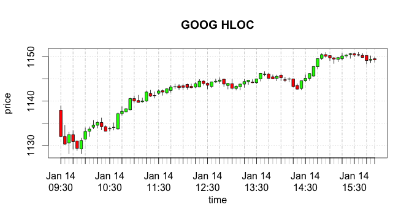

# rkdb 

A KX [Fusion interface](https://code.kx.com/q/interfaces#fusion)

Connects R to a kdb+ database to extract partially analyzed data into R
for further local manipulation, analysis and display.

*    [Using R with kdb+](r-and-q.md)
*   [Other methods](other-methods.md)

Operating systems: tested and available for

-   Linux (64-bit)
-   macOS
-   Windows (32-bit and 64-bit)

The interface allows R to connect to a kdb+ database and send it a request, which can optionally return a result.
Three methods are available:

1.  `open_connection(hostname, port, username:password)`

    Open a connection to a q database. Multiple connections can be open at once.

2.  `close_connection(connectionhandle)`

    Close a connection.

3.  `execute(connectionhandle, request)`

    Execute a request on the specified connection handle. Where `connectionhandle` is:

    -   &gt;0, executes the request synchronously, blocking the call
    -   &lt;0, executes the request asynchronously; the result may arrive later

To open and initialize a connection from R to a kdb+ process on `localhost` listening on port 5000, with a trade table loaded:

```r
library(rkdb)
test.rkdb()  # run kdb+ on localhost:5000 for this
h<-open_connection("127.0.0.1",5000,"testusername:testpassword")
```

To request data and plot it:

```r
> execute(h,"select count i by date from trade")
date x
1 2014-01-09 5125833
2 2014-01-10 5902700
3 2014-01-13 4419596
4 2014-01-14 4106744
5 2014-01-15 6156630
> # Setting TZ and retrieving time as timestamp simplifies time conversion
> Sys.setenv(TZ = "GMT")
> res<-execute(h,"select tradecount:count i, sum size, last price, vwap: size wavg price by time:0D00:05 xbar date+time from trade where date=2014.01.14,sym=`GOOG,time within 09:30 16:00")
head(res)
                 time tradecount   size    price     vwap
1 2014-01-14 09:30:00       1471 142868 1132.000 1136.227
2 2014-01-14 09:35:00       1053  65599 1130.250 1132.674
3 2014-01-14 09:40:00       1019  77808 1132.422 1130.405
4 2014-01-14 09:45:00        563  39372 1130.846 1130.835
5 2014-01-14 09:50:00        586  38944 1129.312 1129.999
> plot(res$time ,res$price ,type="l",xlab="time",ylab="price")
```

which produces the plot in Figure 1:

<br>
_Figure 1: Last-traded price plot drawn from R_

More comprehensive graphing is available in additional R packages, which can be freely downloaded.
For example, using the [xts](http://r-forge.r-project.org/projects/xts) package:

```r
> library(xts)
# extract the HLOC buckets in 5-minute intervals
> res<-execute(h,"select high:max price,low:min price,open:first price, close:last price by time:0D00:05 xbar date+time from trade where date=2014.01.14,sym=`GOOG,time within 09:30 16:00")
# create an xts object from the returned data frame
# order on the time column
> resxts <-xts(res[,-1], order.by=res[,'time'])
# create a vector of colours for the graph
# based on the relative open and close prices
> candlecolors <- ifelse(resxts[,'close'] > resxts[,'open'], 'GREEN', 'RED')
# display the candle graph with appropriate labels
> plot.xts(resxts, type='candles', width=100, candle.col=candlecolors, bar.col='BLACK', xlab="time", ylab="price", main="GOOG HLOC")
```

produces the plot in Figure 2:

<br>
_Figure 2: Candlestick plot using xts package_

Another popular package is the [quantmod](http://www.quantmod.com) package which contains the `chartSeries` function.

```r
> library(quantmod)
# extract the last closing price in 30 second buckets
> res<-execute(h,"select close:last price by time:0D00:00:30 xbar date+time from trade where date=2014.01.14,sym=`GOOG,time within 09:30 16:00")
# create the closing price xts object
> closes <-xts(res[,-1], order.by=res[,'time'])
# chart it. Add Bollinger Bands to the main graph
# add additional Relative Strength Indicator and Rate Of Change graphs
> chartSeries(closes,theme=chartTheme("white"),TA=c(addBBands(),addTA(RSI( closes)),addTA(ROC(closes))))
```

This produces the plot shown in Figure 3:

<br>
_Figure 3: Chart example from quantmod package_

Close the connection when done: 

```r
> close_connection(h)
[1] 0
```

Help with more details and some examples is available via `R` help facilities.

```r
?close_connection
close_connection            package:rkdb            R Documentation

Close connection to kdb+ instance.

Description:

     Close connection to kdb+ instance.

Usage:

     close_connection(con)

Arguments:

     con: Connection handle.

Value:

     0 on closed connection.

Examples:

     ## Not run:

     close_connection(h)
     ## End(Not run)

?execute
?open_connection
```
